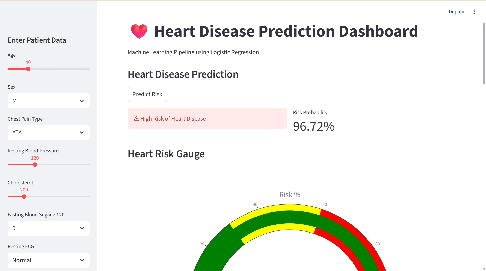

# ❤️ Heart Disease Prediction – Streamlit App

An end-to-end machine learning application that predicts the risk of heart disease using patient health parameters. The project uses a Logistic Regression pipeline and an interactive Streamlit dashboard for real-time prediction and data visualization.

## Features

* Machine learning pipeline using Scikit-learn
* Logistic Regression model with hyperparameter tuning (GridSearchCV)
* Interactive Streamlit dashboard
* Real-time heart disease risk prediction
* Risk probability visualization
* Data exploration and correlation heatmap
* Downloadable patient report

## Dataset

The dataset contains patient health parameters used to predict heart disease.

### Features

* Age
* Sex
* ChestPainType
* RestingBP
* Cholesterol
* FastingBS
* RestingECG
* MaxHR
* ExerciseAngina
* Oldpeak
* ST_Slope

### Target

**HeartDisease**

* `1` → Presence of heart disease
* `0` → No heart disease

## Tech Stack

* Python
* Scikit-learn
* Pandas
* NumPy
* Matplotlib
* Seaborn
* Plotly
* Streamlit

## Project Structure

```
heart-disease-prediction-streamlit
│
├── app.py
├── miniproject.py
├── heart.csv
├── heart_model.pkl
├── requirements.txt
├── .gitignore
└── README.md
```

## Installation

Clone the repository:

```
git clone https://github.com/Subasri23Hub/heart-disease-prediction-streamlit.git
```

Navigate to the project directory:

```
cd heart-disease-prediction-streamlit
```

Install dependencies:

```
pip install -r requirements.txt
```

## Run the Application

Start the Streamlit app:

```
streamlit run app.py
```

The application will open in your browser at:

```
http://localhost:8501
```
## Application Preview



## Future Improvements

* Add additional ML models for comparison
* Feature importance visualization
* Deploy the application using Streamlit Cloud
* Improve UI with advanced dashboard components

## Author

Subasri
GitHub: https://github.com/Subasri23Hub
